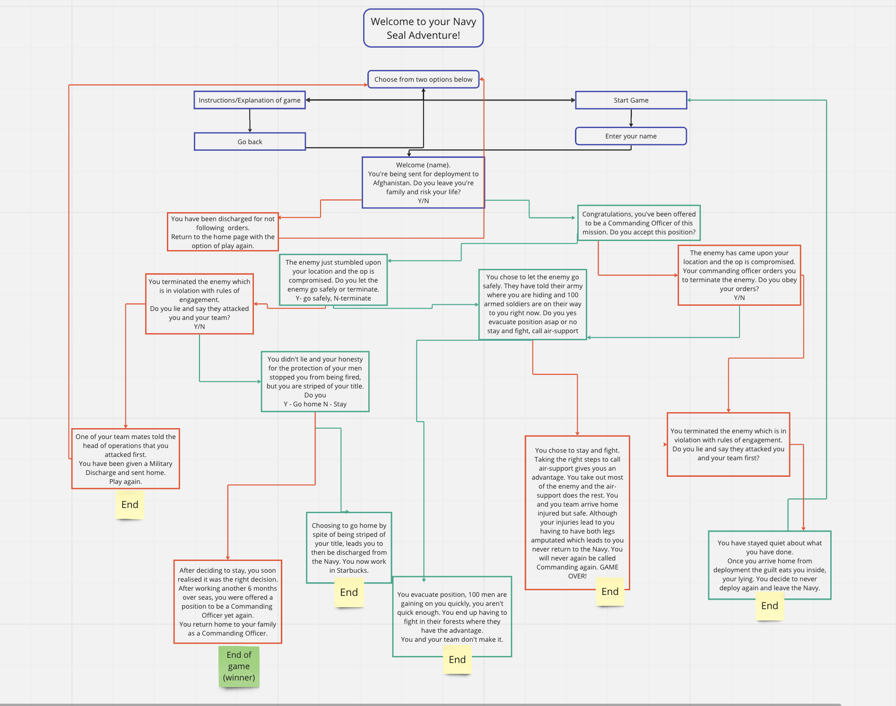
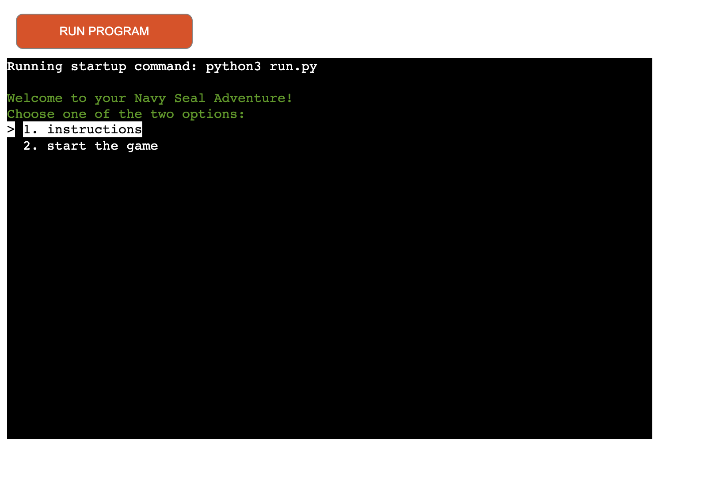
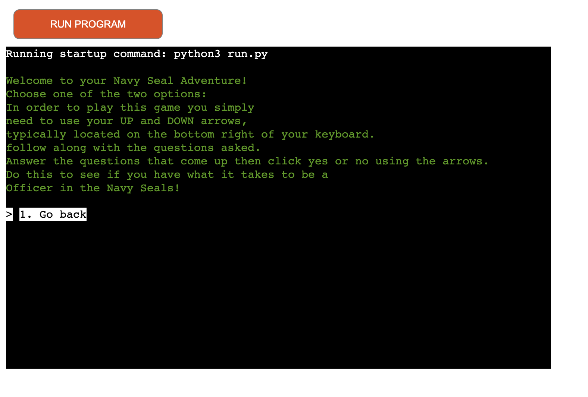
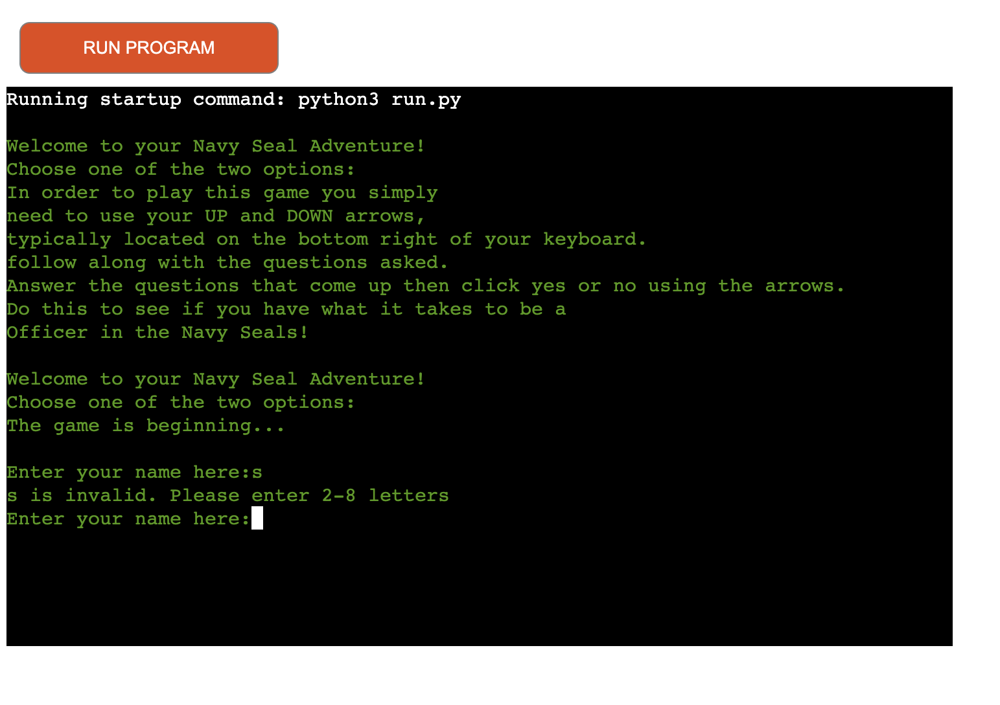
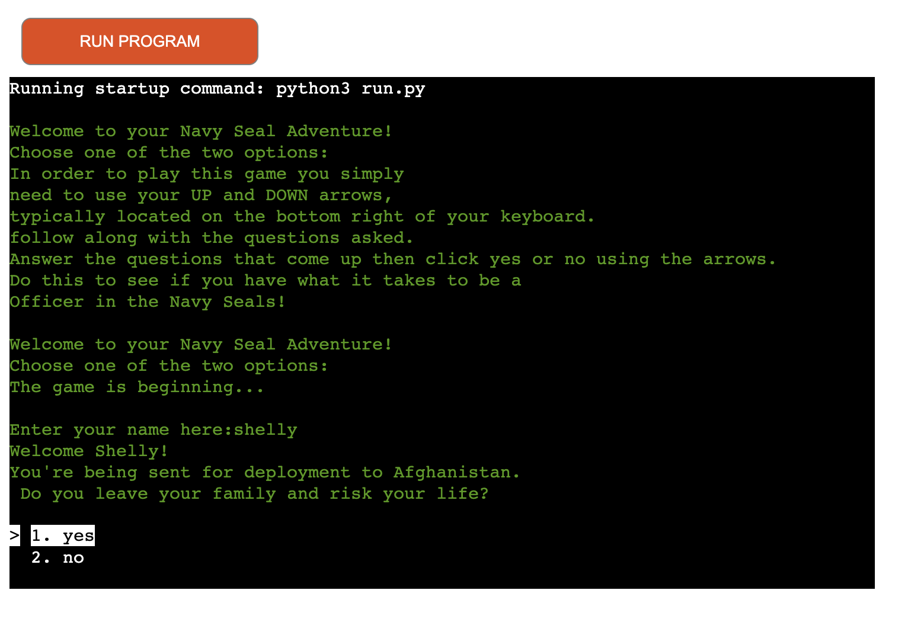
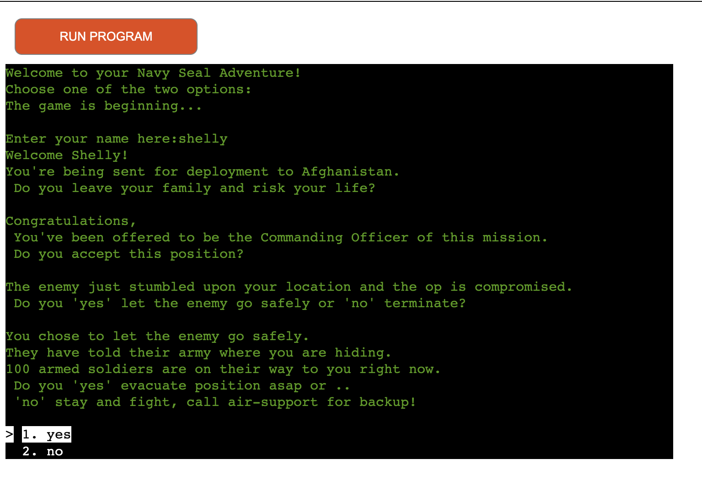

# NAVY SEAL ADVENTURE

My vision for this project was to have a choose your own adventure, based in a military field. While keeping the user guessing what the outcome could be, and to have them thinking of what they'd choose if they ever be in that position. 

My inspiration for this topic of choice was my interest and amazment for the Navy Seals and the extraordinary jobs that they do, the choices they have to make in split seconds.

I wanted to incorporate the user to have them seeing what they would choose if they had to make a tough choice while keeping it light and fun!

Below is what the site would look like on different screens, although not required I thought it would be nice to see.
https://ui.dev/amiresponsive?url=https://navy-seal-adventure-8561df0d1cfb.herokuapp.com

Again, below here is a screenshot of my Miro, it is the original layout of the way my vision for the project had began, although some results and questions have changed slightly for a better experience.

## UX

For user experience I wanted to have a seriousness to get the user thinking and using their heads on how they would approach that situation while also thinking about how they can win!
To bring the military feel to the project with the background being quite basic without CSS I decided to use colorama to add green colour to the printed text. 

I thought this would bring the project together as the text font is quite military based in itself. Old computer type of text font so that played well into my theme for this project.

Although the all over theme of military is serious in nature I wanted to add some bits of humor to to some of the results, to keep it light-hearted. 

## User Stories

- As a first time visitor I want to understand the purpose of the programme.
- I would like the option of instructions to tell me how to play, and then an option to start the game after I have read the instructions.
- I would appreciate the option to play the game straight away, if I didn't want to read the instructions.
- I would prefer to have the game easy to navigate, rather than have to make too much effort typing answers.
- To have questions short and sweet so I do not get bored while reading.
- I would like to have the text in a colour so it is easy on the eyes to read.
- I would like to have my interest peaked the the results of each question and answer revealed.

### Frequent User Stories

- As a frequent user I would appreciate the navigation system to be the same for each question so I know exactly what to do.
- I would like to get a different outcome of the result, depending on how I feel that day if my answers would change would it result in a differen't outcome.

## Features

Being a simplistic project I wanted to add features that add a bit more user interaction to the site.
While the features might be small, they bring it together nicely.

### Existing Features

- **Welcome with instructions/start**

    - The user is greeted with a 'Welcome to your Navy Seal Adventure!" which straight away brings the user in to that this is their adventure.
    - The user is given the option of clicking instructions to be instructed on what they need to do, or they can click start and begin the game straight away.

- **Instructions**

    - Here the user is given the run down on what to do and how to play the game. They then have a 'Go Back' option which will bring them back to instructions or start game again.

- **Start Game**

    - When the user starts the game they will be told the game is beginning and asked for their name. The user will need to enter 2-8 letters in their name or they will be greeted with an error to say that their name was invalid please enter 2-8 letters. 

- **User Name**

    - I have added that when a user types their name in all lower case letters, they will be greeted with their name capitalized.

- **Game**

    -  With the game I have added complete line spaces between each separate print so it is easier for the user to read so it will not get mushed together and confusing for the user.

### Future Features

I would be interested in doing this project as a whole with HTML and CSS also added. To have background images and more involvement for the visual aspect.

To add more design to the quesions as a whole, to be more imaginative with the length of the adventure and the type of questions.

## Tools & Technologies Used

### Languages

- [Python](https://www.python.org) used as the back-end programming language.

- [Git](https://git-scm.com) used for version control. (`git add`, `git commit`, `git push`)
- [GitHub](https://github.com) used for secure online code storage.
- [Gitpod](https://gitpod.io) used as a cloud-based IDE for development.
- [Heroku](https://www.heroku.com) used for hosting the deployed back-end site.
- [colorama](https://pypi.org/project/colorama/) used for adding colour to the text.
- [os](https://docs.python.org/3/library/os.html) was used to clear the terminal before running the programme.
- [simple terminal menu](https://pypi.org/project/simple-term-menu/) used to implement the menu.

###  Functions

- `main()`
    - Run all program functions.

### Imports

I've used the following Python packages and/or external imported packages.

- `colorama`: used for including color in the terminal
- `simple terminal menu`: used to implement the menu

## Testing

For all testing, please refer to the [TESTING.md](TESTING.md) file.

## Deployment

Code Institute has provided a [template](https://github.com/Code-Institute-Org/python-essentials-template) to display the terminal view of this backend application in a modern web browser.
This is to improve the accessibility of the project to others.

The live deployed application can be found deployed on [Heroku](https://navy-seal-adventure-8561df0d1cfb.herokuapp.com).

### Heroku Deployment

This project uses [Heroku](https://www.heroku.com), a platform as a service (PaaS) that enables developers to build, run, and operate applications entirely in the cloud.

Deployment steps are as follows, after account setup:

- Select **New** in the top-right corner of your Heroku Dashboard, and select **Create new app** from the dropdown menu.
- Your app name must be unique, and then choose a region closest to you (EU or USA), and finally, select **Create App**.
- From the new app **Settings**, click **Reveal Config Vars**, and set the value of KEY to `PORT`, and the value to `8000` then select *add*.
- If using any confidential credentials, such as CREDS.JSON, then these should be pasted in the Config Variables as well.
- Further down, to support dependencies, select **Add Buildpack**.
- The order of the buildpacks is important, select `Python` first, then `Node.js` second. (if they are not in this order, you can drag them to rearrange them)

Heroku needs two additional files in order to deploy properly.
- requirements.txt
- Procfile

You can install this project's **requirements** (where applicable) using:
- `pip3 install -r requirements.txt`

If you have your own packages that have been installed, then the requirements file needs updated using:
- `pip3 freeze --local > requirements.txt`

The **Procfile** can be created with the following command:
- `echo web: node index.js > Procfile`

For Heroku deployment, follow these steps to connect your own GitHub repository to the newly created app:

Either:
- Select **Automatic Deployment** from the Heroku app.

Or:
- In the Terminal/CLI, connect to Heroku using this command: `heroku login -i`
- Set the remote for Heroku: `heroku git:remote -a app_name` (replace *app_name* with your app name)
- After performing the standard Git `add`, `commit`, and `push` to GitHub, you can now type:
	- `git push heroku main`

The frontend terminal should now be connected and deployed to Heroku!

### Local Deployment

This project can be cloned or forked in order to make a local copy on your own system.

For either method, you will need to install any applicable packages found within the *requirements.txt* file.
- `pip3 install -r requirements.txt`.

If using any confidential credentials, such as `CREDS.json` or `env.py` data, these will need to be manually added to your own newly created project as well.

#### Cloning

You can clone the repository by following these steps:

1. Go to the [GitHub repository](https://github.com/shellym96/navy-seal-adventure) 
2. Locate the Code button above the list of files and click it 
3. Select if you prefer to clone using HTTPS, SSH, or GitHub CLI and click the copy button to copy the URL to your clipboard
4. Open Git Bash or Terminal
5. Change the current working directory to the one where you want the cloned directory
6. In your IDE Terminal, type the following command to clone my repository:
	- `git clone https://github.com/shellym96/navy-seal-adventure.git`
7. Press Enter to create your local clone.

Alternatively, if using Gitpod, you can click below to create your own workspace using this repository.

Please note that in order to directly open the project in Gitpod, you need to have the browser extension installed.
A tutorial on how to do that can be found [here](https://www.gitpod.io/docs/configure/user-settings/browser-extension).

#### Forking

By forking the GitHub Repository, we make a copy of the original repository on our GitHub account to view and/or make changes without affecting the original owner's repository.
You can fork this repository by using the following steps:

1. Log in to GitHub and locate the [GitHub Repository](https://github.com/shellym96/navy-seal-adventure)
2. At the top of the Repository (not top of page) just above the "Settings" Button on the menu, locate the "Fork" Button.
3. Once clicked, you should now have a copy of the original repository in your own GitHub account!

## Credits

- For ideas on how to begin the project I watched youtube videos, as I was thinking of either Rock, Paper and Siccors game or else the one I have chosen.

### Content

| Source | Location | Notes |
| --- | --- | --- |
| [YouTube](https://www.youtube.com/watch?v=DEcFCn2ubSg) | Adventure game | to help guide me in the right direction on which way my code was taking. |
| [YouTube](https://www.youtube.com/watch?v=u51Zjlnui4Y&t=11s) | Colorama | help show me how to use colorama on a macbook |
| [Markdown Builder](https://traveltimn.github.io/markdown-builder) | README and TESTING | tool to help generate the Markdown files |

### Acknowledgements

I firstly would like to thank my new mentor Juliia,  having a new mentor assigned to me mid way through Python was nerve wracking but Juliia helped make me feel so confident. She really helped me learn a lot throughout this project and I am delighted with how much knowledge I have gained from doing this.
I feel very lucky to have had Tim as my first mentor and now Juliia, my knowlegde will continue to grow.

- I would like to thank my new Code Institute mentor, [Juliia_mentor](https://github.com/IuliiaKonovalova) for her help and her dedicated time to push me to be better.
- I would like to thank my past Code Institute mentor, [Tim Nelson](https://github.com/TravelTimN) for their support throughout my time so far on this journey.
- I would like to thank the [Code Institute](https://codeinstitute.net) tutor team for their assistance with troubleshooting and debugging some project issues.
- I would like to thank the [Code Institute Slack community](https://code-institute-room.slack.com) for the moral support; it kept me going during periods of self doubt and imposter syndrome.

