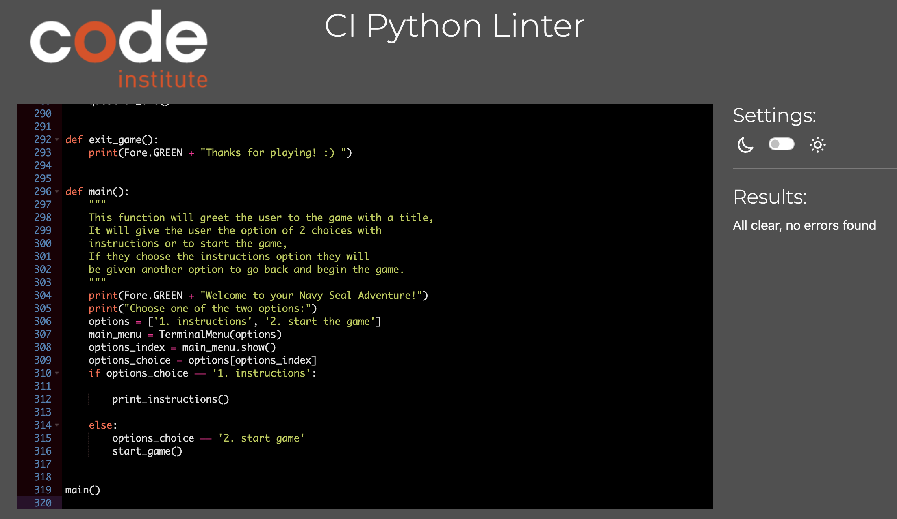
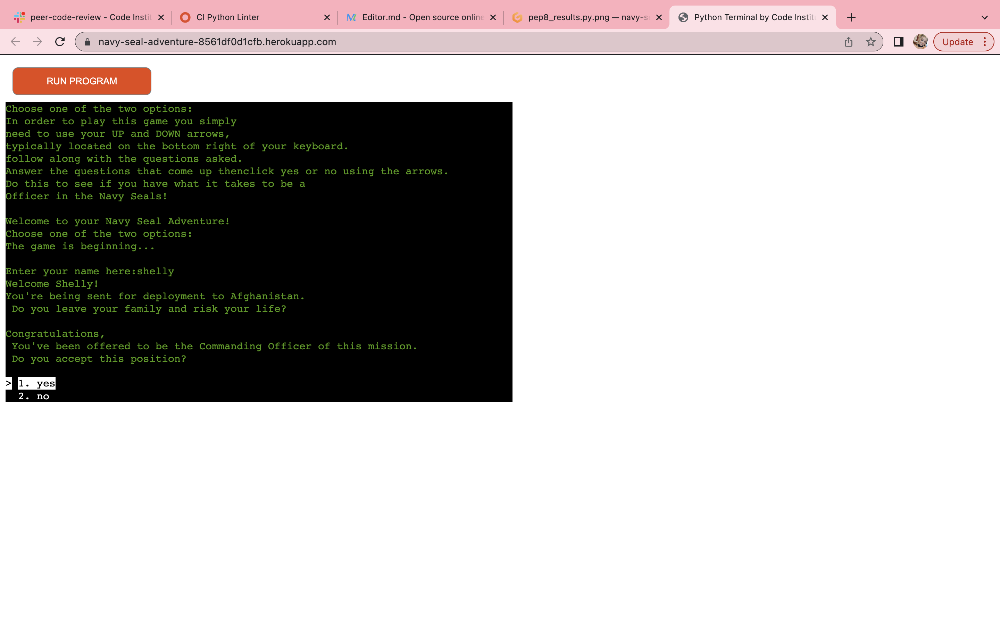
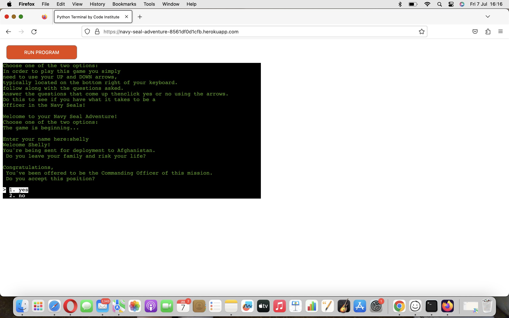
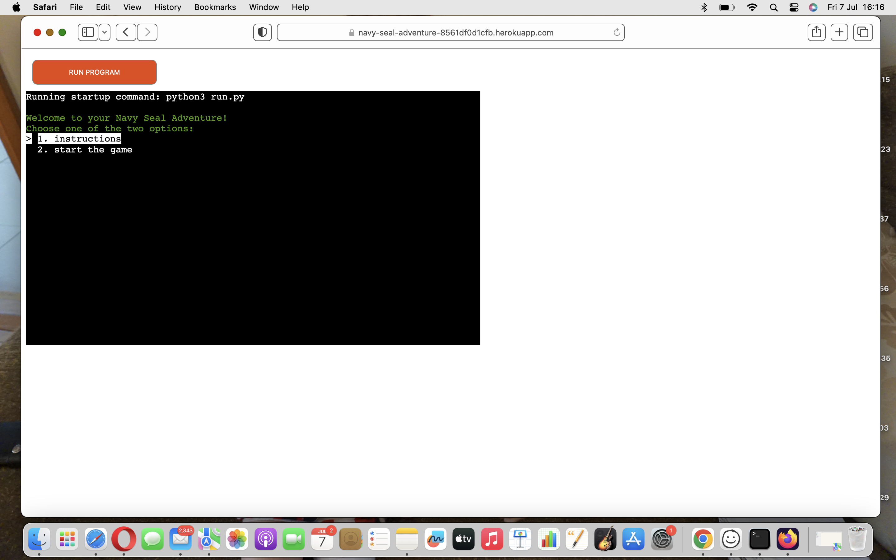
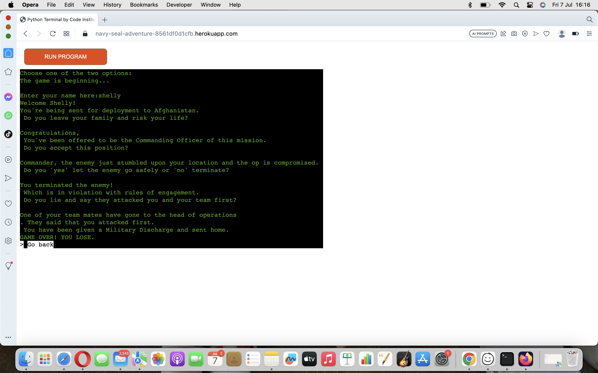

# Testing

Return back to the [README.md](README.md) file.

I have been testing this programme throught the entire time I have been creating and completing it.

Also asking friends and other students to play along with the adventure to check for spelling and grammer mistakes.

## Code Validation

I have used the recommended [PEP8 CI Python Linter](https://pep8ci.herokuapp.com) to validate all of my Python files.

| File | CI URL | Screenshot | Notes |
| --- | --- | --- | --- |
| run.py | [PEP8 CI](https://pep8ci.herokuapp.com/https://raw.githubusercontent.com/shellym96/navy-seal-adventure/main/run.py) |  | Pass - No Errors |
| results.py | [PEP8 CI](https://pep8ci.herokuapp.com/https://raw.githubusercontent.com/shellym96/navy-seal-adventure/main/boutique-ado/settings.py) |  | Pass - No Errors ||

## Browser Compatibility

I've tested my deployed project on multiple browsers to check for compatibility issues.

| Browser | Screenshot | Notes |
| --- | --- | --- |
| Chrome |  | Works as expected |
| Firefox |  | Works as expected |
| Safari |  | Controls did not work |
| Opera |  | Works as expected |

## Manual Testing

| Page | User Action | Expected Result | Notes |
| --- | --- | --- | --- | --- |
| Welcome | Run Programme | Greets user and gives user two options of instructions and start game | Works |
| Instructions | Use enter key | Tells the user the instructions on how to play the game | Works |
| Go Back Option | Use enter key | Bring user back to options of instructions and start game | Works |
| Start Game | Use down arrow, letters and enter key | Ask user for their name (provide 2-8 letters or will result in an invalid message to tell them so) | Works |
| Greet user by name and first question | Use arrows and enter key | Capitalize users name if they use lowercase, then present first question | Works |
| Present questions and options | Use arrows and enter key | Present the user with the next question, give them a yes or no option | Works |
| Give the user their results | Use arrows and enter key | Present the user with their results from the answers they have chosen | Works |
| Go Back option | Use arrows and enter key | Give the option to go back and play again | Works |
| Clear the terminal | Click go back at end | Clears the terminal so if the user wants to play again there isn't all of the text there from their previous game | Works |

## Bugs and Fixed bugs

| Bug | Comments | Status |
| --- | --- |
| Go Back | When adding the go back method, I had used to wrong function which resulted in the end_of_game printing. This was fixed when I realized I had used the wrong function | Fixed |
| Colorama | When adding the green to the text I firstly had to use numbers to get the colour green, but once I added the package to the top of my code it worked perfectly as Fore.GREEN for better practice. | Fixed |
| Exit Game | When adding an exit game function it broke my code, and the print statement would print even when trying to just start the game | Unfixed |

There are no remaining bugs that I am aware of.
